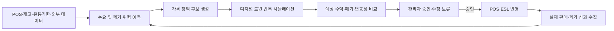

# FreshWatch AI

> AI 기반 신선식품 수요 예측 및 다이나믹 프라이싱 자동화 플랫폼

FreshWatch AI는 신선식품의 판매 이력, 재고, 유통기한, 가격, 날씨와 행사 정보를 분석해 상품별 할인율과 할인 시점을 추천하는 B2B 의사결정 지원 플랫폼입니다.

단순히 폐기량만 줄이는 것이 아니라 **폐기로 인한 원가 손실과 과도한 할인으로 인한 마진 손실을 함께 계산**해 점포의 예상 수익이 가장 높은 가격 정책을 찾습니다. 추천 정책은 디지털 트윈 환경에서 먼저 검증되며, 관리자의 승인 이후 POS와 ESL(Electronic Shelf Label)에 반영됩니다.

## 프로젝트 배경

신선식품은 유통기한이 짧고 수요 변동성이 커 예측이 빗나가면 과잉 재고와 폐기로 이어집니다. 기존 마감 할인은 주로 담당자의 경험과 일괄 할인 규칙에 의존하기 때문에 다음과 같은 한계가 있습니다.

- 상품별 수요와 폐기 위험을 충분히 반영하기 어렵습니다.
- 적절한 할인 시점과 할인율을 놓칠 수 있습니다.
- 폐기를 줄이려다 정가 판매가 가능한 상품까지 할인해 마진이 훼손될 수 있습니다.
- 점포와 담당자마다 판단 기준이 달라 운영 일관성이 떨어집니다.
- ESL은 가격을 빠르게 바꿀 수 있지만, 어떤 가격이 적절한지 결정해 주지는 않습니다.

FreshWatch AI는 **할인 대상 선별 → 가격 정책 생성 → 가상 검증 → 관리자 승인 → 실행 → 성과 학습**의 폐쇄형 운영 루프로 이 문제를 해결합니다.

## 핵심 목표

- 상품별 수요와 폐기 위험 예측
- 폐기 손실과 할인 손실을 함께 고려한 수익 최적화
- 유통기한별 차등 할인율 및 할인 시점 추천
- 디지털 트윈 기반 가격 정책 사전 검증
- 관리자 중심의 안전한 가격 변경 프로세스
- POS·ESL 연계를 통한 신속한 정책 실행
- 실제 운영 결과를 활용한 지속적인 모델 개선

## 주요 기능

### 1. AI 기반 할인 정책 추천

판매량, 판매 속도, 재고, 유통기한, 가격, 원가, 기존 할인 이력과 외부 변수를 분석합니다. 폐기 위험이 높은 상품을 선별한 뒤 복수의 할인율·할인 시점 후보를 생성합니다.

### 2. 디지털 트윈 시뮬레이션

실제 구매 패턴을 학습한 가상 소비자 환경에서 각 가격 정책을 반복 실행합니다. 정책별 예상 판매량, 잔여 재고, 매출, 폐기량, 폐기비용과 결과 변동성을 비교합니다.

### 3. 관리자 의사결정 지원

현재 가격 유지, 기존 마감 할인, AI 추천 정책의 예상 성과를 한 화면에서 비교합니다. AI의 추천 근거와 불확실성을 함께 제공하며 관리자는 정책을 승인·수정·보류할 수 있습니다.

### 4. POS·ESL 가격 반영

관리자가 승인한 정책을 기존 POS와 ESL에 반영합니다. ESL에는 가격, 할인율과 유통기한 정보를 표시할 수 있습니다.

### 5. 재고·폐기 위험 모니터링

상품별 재고 소진 현황, 예상 판매량과 폐기 위험도를 모니터링합니다. 예상 잔여 재고와 폐기비용이 큰 상품을 식별해 추가 할인 또는 정책 유지 판단을 지원합니다.

### 6. 운영 결과 기반 재학습

정책 적용 후 실제 판매량, 매출과 폐기 결과를 다시 수집합니다. 예측과 실제 성과의 오차를 분석해 수요 예측 모델과 소비자 행동 시뮬레이션을 지속적으로 보정합니다.

## 서비스 흐름



## AI 모델 구성

### A. 신선식품 가격 최적화 모델

상품 상태와 예상 수요를 바탕으로 최적 할인율과 할인 시점을 추천합니다.

**입력**

- POS 판매량, 판매 속도와 기존 할인 이력
- 상품 가격, 원가, 현재 재고와 유통기한별 재고
- 시간대, 요일, 날씨, 행사 등 수요 영향 변수

**출력**

- 추천 할인율과 할인 시점
- 관리자 검토용 복수 가격 정책 후보
- 정책별 예상 판매량과 잔여 재고
- 예상 매출, 폐기량과 폐기비용

**적용 후보 기술**

- LightGBM·XGBoost 기반 시계열 수요 예측
- 예상 이익과 폐기 손실을 목적함수로 사용하는 가격 정책 최적화

### B. 강화학습 기반 가상 소비자 모델

실제 소비자의 구매 패턴을 재현한 디지털 트윈 판매 환경을 구축하고 가격 정책 적용 결과를 사전에 검증합니다.

**입력**

- 소비자의 구매·미구매 및 구매량 이력
- 가격, 할인율, 신선도와 잔여 유통기한
- 시간대, 요일, 날씨, 행사와 매장 상황

**출력**

- 정책별 평균 성과와 변동성
- 예상 판매량, 매출, 잔여 재고와 폐기비용
- 최악 시나리오를 포함한 정책 위험 정보

**적용 후보 기술**

- Clustering을 이용한 소비자 유형 구성
- Behavior Cloning을 이용한 초기 구매 행동 학습
- 강화학습 기반 소비자 행동 시뮬레이션
- Monte Carlo Simulation 기반 반복 검증

## 가격 최적화 원칙

가장 높은 할인율이 항상 가장 좋은 정책은 아닙니다. 할인율이 높아지면 추가 판매와 폐기비용 절감 효과가 커질 수 있지만, 정가로 판매될 상품까지 할인되어 마진 손실도 증가합니다.

따라서 플랫폼은 다음 요소를 함께 비교합니다.

```text
예상 순효과
= 추가 판매수익
+ 폐기비용 절감액
- 기존 판매분 할인손실
```

AI는 폐기량이 가장 적은 정책이 아니라 **예상 순효과가 가장 큰 정책**을 추천합니다.

## 활용 데이터

실제 유통사의 POS·ERP 데이터는 외부에서 확보하기 어렵기 때문에, 초기 개발에서는 공개 데이터와 합성 데이터를 결합한 하이브리드 데이터셋을 사용합니다.

| 데이터 구분 | 주요 항목 | 활용 목적 |
| --- | --- | --- |
| 판매 데이터 | 상품·점포·일자별 판매량, 가격, 행사 | 수요 및 가격 반응 학습 |
| 재고 데이터 | 입고량, 현재 재고, 유통기한별 재고 | 재고 소진 및 폐기 위험 예측 |
| 상품 데이터 | 정상가, 원가, 신선도, 소비기한 | 정책별 손익 계산 |
| 외부 데이터 | 날씨, 공휴일, 요일, 시간대, 행사 | 수요 변동 요인 반영 |
| 소비자 데이터 | 구매 여부, 구매량, 상품군별 소비 비율 | 가상 소비자 행동 구성 |

초기 검토 데이터셋:

- Kaggle M5 Forecasting
- Favorita Grocery Sales Forecasting
- Walmart Store Sales Forecasting
- Store Sales Time Series Forecasting
- 국내 기상·공휴일·가격 관련 공개 데이터
- 공개 데이터의 EDA 결과를 기반으로 생성한 합성 재고·유통기한·폐기 데이터

## 국내 유통 환경 반영

해외 판매 데이터만으로는 국내 신선식품 수요를 충분히 설명하기 어렵습니다. 모델과 운영 정책에는 다음과 같은 국내 변수를 추가로 고려합니다.

- 명절, 김장철, 장마 등 국내 특유의 계절 수요
- 대형마트 의무휴업일과 휴업 전날의 재고 소진 필요성
- 소비기한 제도
- 쿠폰·프로모션·협력사 계약 조건과의 충돌 여부
- 동적 할인에 대한 소비자 수용성과 가격 공정성

사전에 합의된 판매가나 프로모션이 적용되는 상품은 동적 할인 대상에서 제외하는 방식으로 운영 위험을 줄입니다.

## 운영 원칙: Human-in-the-Loop

가격은 고객 경험과 매출에 직접 영향을 주기 때문에 AI가 자동으로 확정하지 않습니다.

```text
AI 추천 → 관리자 검토 → 승인·수정·보류 → POS·ESL 반영
```

이를 통해 예측 오류, 계약 조건, 현장 상황과 소비자 반응을 관리자가 최종적으로 확인할 수 있습니다.

## 기대 효과

- 폐기 위험 상품을 선별해 불필요한 할인 최소화
- 폐기 원가 손실과 할인 마진 손실을 함께 줄여 수익성 개선
- 상품별 할인 의사결정 자동화와 점포 간 기준 표준화
- 재고 회전율 향상과 과잉 재고 감소
- 기존 POS·ERP·ESL을 활용한 단계적 도입
- 음식물 폐기와 탄소배출 저감을 통한 ESG 성과 지원

과제 정의 단계에서 검토한 선행 연구와 해외 사례는 다이나믹 프라이싱 도입 후 매출·이익 증가 및 폐기 감소 가능성을 제시합니다. 다만 해당 수치는 본 프로젝트의 실증 결과가 아니며, 실제 효과는 파일럿 운영을 통해 별도로 검증해야 합니다.

## 대상 고객과 적용 시나리오

- **주요 고객:** 대형마트 및 신선식품 유통사
- **우선 적용 시나리오:** 롯데마트 점포의 신선식품 할인 의사결정
- **제안사 관점:** CJ올리브네트웍스

초기에는 일부 점포·품목을 대상으로 파일럿을 진행하고, 예측 정확도와 손익 개선 효과를 확인한 뒤 적용 범위를 단계적으로 확대하는 방식을 가정합니다.

## 개발 로드맵

- [ ] 공개·합성 데이터 수집 및 품질 검증
- [ ] 상품별 수요 예측 베이스라인 구축
- [ ] 폐기 위험도 및 할인 대상 선별 모델 구현
- [ ] 가격 정책 후보 생성과 손익 계산 로직 구현
- [ ] 가상 소비자 및 디지털 트윈 시뮬레이션 구축
- [ ] 관리자 대시보드 프로토타입 구현
- [ ] POS·ESL 연동 인터페이스 설계
- [ ] 오프라인 평가 및 시나리오 테스트
- [ ] 파일럿 운영을 통한 KPI 검증
- [ ] 실제 결과 기반 재학습 파이프라인 구축

## 검증 지표

| 구분 | 주요 지표 |
| --- | --- |
| 예측 성능 | MAE, RMSE, WMAPE |
| 재고 성과 | 폐기량, 폐기율, 잔여 재고, 재고 회전율 |
| 수익 성과 | 매출, 매출총이익, 폐기비용, 할인손실, 예상 순효과 |
| 정책 안정성 | 평균 성과, 변동성, 최악 시나리오 |
| 운영 성과 | 추천 승인율, 가격 변경 소요 시간, 담당자 업무 시간 |

## 팀

KT AIVLE School 수도권 6반 17조

- 정수빈
- 김유강
- 김윤성
- 박나영
- 이다영
- 이현서
- 임종욱

## 참고

이 README는 프로젝트 과제 정의서를 바탕으로 작성된 기획 단계 문서입니다. 실제 저장소의 기술 스택, 실행 방법, 환경 변수, API 명세와 디렉터리 구조는 구현이 확정된 후 추가해야 합니다.

