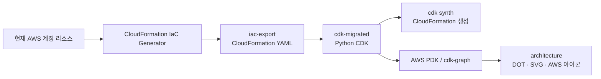
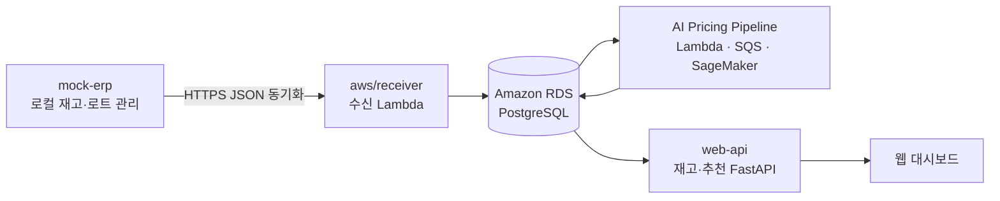
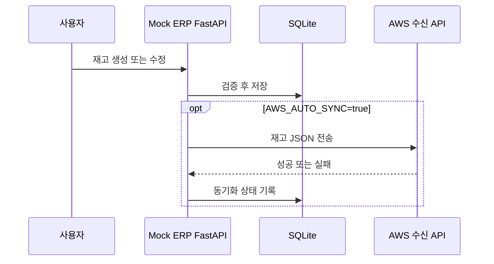
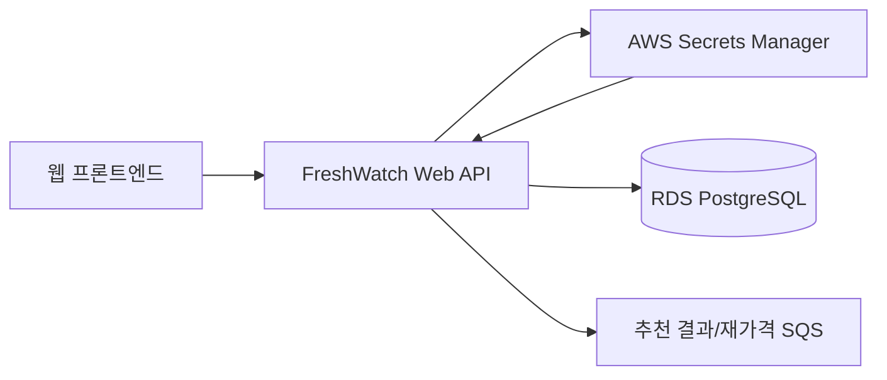

# Dynamic Pricing Cloud 구성 안내

이 디렉터리는 다이나믹 프라이싱 프로젝트에서 사용하는 **AWS 인프라 정의**, **AWS에서 추출한 IaC 원본**, **Mock ERP**, **웹 조회 API**를 모아 둔 영역이다.

> 주의: `cloud/` 아래에는 실제 배포 후보 코드와 문서·시각화 전용 코드가 함께 있다. 특히 `cdk-migrated`의 참조 아키텍처는 그림 생성을 위한 모델이며 그대로 배포하면 안 된다.

## 전체 구성 요약

| 경로 | 분류 | 주요 역할 | 직접 배포 대상 여부 |
|---|---|---|---|
| [`iac-export/`](./iac-export/) | IaC 원본 | AWS IaC Generator가 계정 리소스를 스캔하여 만든 CloudFormation YAML 보관 | 아니요. 마이그레이션 입력 자료 |
| [`cdk-migrated/`](./cdk-migrated/) | 인프라 코드·시각화 | IaC 원본을 Python CDK로 변환한 프로젝트와 AWS PDK 다이어그램 보관 | 일부만 배포 후보 |
| [`mock-erp/`](./mock-erp/) | 데이터 원천·개발 도구 | 신선식품 재고를 로컬에서 관리하고 AWS 수신 API로 전송 | 로컬 앱은 아니요, `aws/receiver`는 Lambda 후보 |
| [`web-api/`](./web-api/) | 백엔드 API | RDS 재고와 AI 가격 추천 결과를 조회·승인·재요청하는 FastAPI | EC2/ASG 배포 대상 |

## 디렉터리 구조

```text
cloud/
├── README.md                         # 현재 문서
├── iac-export/                       # AWS IaC Generator 출력 원본
│   ├── aivle-dynamic-pricing-template-1787105930329.yaml
│   └── aivle-dynamic-pricing-template-cdk-migrate.yaml
├── cdk-migrated/
│   └── DynamicPricingInfrastructureStack/
│       ├── app.py                    # 원본 배포용 CDK 진입점
│       ├── cdk.json                  # CDK Toolkit 설정
│       ├── migrate.json              # CDK migrate 메타데이터
│       ├── requirements*.txt         # Python/CDK/PDK 의존성
│       ├── dynamic_pricing_infrastructure_stack/
│       │   ├── dynamic_pricing_infrastructure_stack_stack.py
│       │   └── reference_architecture_stack.py
│       ├── reference_app.py          # 기본 참조 다이어그램 진입점
│       ├── step_functions_reference_app.py
│       ├── render_reference_diagram.py
│       ├── render_step_functions_diagram.py
│       ├── architecture/             # DOT/SVG 및 AWS 아이콘 자산
│       ├── cdk.out-reference/        # 기본 참조 모델 합성 결과
│       ├── cdk.out-step-functions/   # Step Functions 모델 합성 결과
│       └── tests/                    # CDK 단위 테스트
├── mock-erp/
│   ├── app/                          # 로컬 FastAPI + SQLite ERP
│   ├── static/                       # ERP 브라우저 화면
│   ├── sample/                       # 입력 예제 CSV/JSON
│   ├── sync-data/                    # AWS 전송용 데이터
│   ├── scripts/                      # 전송·문서 내보내기 도구
│   ├── exports/api-docs/             # OpenAPI 및 API 사용 문서
│   ├── aws/receiver/                 # AWS 수신 Lambda 코드
│   ├── aws/tests/                    # 수신 Lambda 테스트
│   └── tests/                        # 로컬 ERP API 테스트
└── web-api/
    ├── app/                          # FastAPI 애플리케이션
    ├── pricing_recommendation.sql    # 추천 결과 저장 스키마
    ├── asg-user-data.sh              # ASG 인스턴스 초기화
    ├── deploy.sh                     # EC2 릴리스 배포 스크립트
    └── tests/                        # WEB API 테스트
```



## 시스템 데이터 흐름

아래 그림은 폴더들이 런타임에서 담당하는 관계를 단순화한 것이다. 실제 AWS 리소스의 세부 연결은 뒤의 CDK 인프라 그림을 참고한다.



## 1. `iac-export`: AWS 인프라 스캔 원본

`iac-export/`는 AWS CloudFormation IaC Generator로 계정에 존재하는 리소스를 읽어 생성한 YAML을 보관한다. CDK 마이그레이션과 계정 구조 복원의 **입력 자료**이며 애플리케이션 실행 코드는 아니다.

### 핵심 파일

| 파일 | 역할 |
|---|---|
| `aivle-dynamic-pricing-template-1787105930329.yaml` | AWS 계정에서 생성된 원본에 가까운 CloudFormation 템플릿 |
| `aivle-dynamic-pricing-template-cdk-migrate.yaml` | CDK 변환이 가능하도록 일부 비지원 속성을 정리한 마이그레이션 입력 사본 |

### 사용 원칙

- 계정에서 관찰된 리소스 이름과 속성을 확인하는 기준 자료로 사용한다.
- 물리 ARN·ID만 남은 참조는 CDK/PDK가 연결선으로 인식하지 못할 수 있다.
- IaC Generator가 지원하지 않는 속성, 쓰기 전용 속성, 중복 또는 잘못 추론된 리소스가 포함될 수 있다.
- 원본 YAML은 보존하고, 정리가 필요하면 별도 사본에서 수행한다.

## 2. `cdk-migrated`: CDK 프로젝트와 인프라 시각화

실제 CDK 프로젝트 루트는 다음 경로다.

```text
cloud/cdk-migrated/DynamicPricingInfrastructureStack/
```

### CDK 인프라 다이어그램

아래 이미지는 Step Functions를 포함한 참조 아키텍처의 **무향 그래프**다. 화살표 방향 대신 리소스 간 연결 여부에 집중하는 설명용 이미지이며, IAM Role과 Instance Profile 같은 권한 중심 노드는 필터링되어 있다.


[SVG 원본 열기](./cdk-migrated/DynamicPricingInfrastructureStack/architecture/dynamic-pricing-step-functions-undirected.svg)

### 배포용 CDK와 시각화용 CDK 구분

| 구분 | 파일 | 역할 |
|---|---|---|
| 원본 배포 진입점 | `app.py` | IaC Generator에서 변환된 Stack을 CDK App에 등록 |
| 원본 배포 Stack | `dynamic_pricing_infrastructure_stack/dynamic_pricing_infrastructure_stack_stack.py` | 실제 CloudFormation 리소스로 합성되는 마이그레이션 결과 |
| 기본 시각화 진입점 | `reference_app.py` | 참조 관계가 보이는 PDK 그래프 생성 |
| Step Functions 시각화 진입점 | `step_functions_reference_app.py` | Step Functions를 포함한 별도 참조 그래프 생성 |
| 시각화 Stack | `dynamic_pricing_infrastructure_stack/reference_architecture_stack.py` | 물리 ID 대신 CDK 토큰과 명시적 의존성을 사용해 연결 관계를 복원 |
| 기본 후처리 | `render_reference_diagram.py` | PDK DOT의 선·아이콘·레이아웃을 정리하고 SVG 생성 |
| Step Functions 후처리 | `render_step_functions_diagram.py` | 유향·무향 SVG 생성, 직각선 유지, Step Functions 아이콘 복사 |

`reference_architecture_stack.py`는 **시각화 전용 재구성**이다. 그림에서 관계를 표현하기 위한 placeholder와 명시적 dependency가 포함되므로 배포용 Stack으로 사용하지 않는다.

### CDK 프로젝트 내부 폴더

| 경로 | 역할 |
|---|---|
| `dynamic_pricing_infrastructure_stack/` | Python CDK Stack 모듈 |
| `architecture/` | 최종 DOT/SVG와 SVG가 참조하는 AWS 서비스 아이콘 |
| `cdk.out-reference/` | `reference_app.py`가 합성한 Cloud Assembly와 PDK 중간 그래프 |
| `cdk.out-step-functions/` | Step Functions 참조 App의 Cloud Assembly와 PDK 중간 그래프 |
| `tests/unit/` | CDK 템플릿과 Stack을 확인하는 단위 테스트 위치 |
| `.venv/` | 로컬 Python 가상환경. 소스나 배포 산출물이 아니며 일반적으로 Git에 포함하지 않음 |
| `__pycache__/` | Python 실행 캐시. 삭제해도 다시 생성됨 |

### 주요 생성 파일 정의

| 확장자/폴더 | 의미 |
|---|---|
| `.py` | CDK 정의, App 진입점 또는 다이어그램 후처리 코드 |
| `.dot` | AWS PDK가 생성하고 후처리한 Graphviz 그래프 정의 |
| `.svg` | 확대해도 선명한 최종 인프라 다이어그램 |
| `cdk.out-*` | `cdk synth` 과정에서 생성되는 CloudFormation 템플릿·메타데이터·그래프 중간물 |
| `migrate.json` | CDK migrate 과정의 입력/변환 정보 |

### 현재 다이어그램 파일

| 파일 | 설명 |
|---|---|
| `dynamic-pricing-reference.svg` | Step Functions 추가 전 참조 아키텍처 |
| `dynamic-pricing-with-step-functions.svg` | Step Functions를 처음 포함한 보존본 |
| `dynamic-pricing-step-functions-directed.svg` | 서비스 흐름과 의존 방향을 구분한 유향 버전 |
| `dynamic-pricing-step-functions-undirected.svg` | 화살표 없이 연결 관계만 표시한 문서용 버전 |

### 대표 인프라 영역

- **Network Infrastructure**: VPC, Public/Application/Database Subnet, Security Group
- **Web Delivery Infrastructure**: CloudFront, Application Load Balancer, Listener, Target Group, Auto Scaling Group, EC2
- **Database Infrastructure**: RDS PostgreSQL, DB Subnet Group, Secrets Manager, Mock ERP Writer Lambda
- **AI Pricing Pipeline**: EventBridge Scheduler, Lambda, SQS, S3, SageMaker Endpoint
- **Step Functions Infrastructure**: 다이나믹 프라이싱 작업 순서를 표현하는 State Machine

### 안전한 확인 명령

다음 명령은 템플릿 합성까지만 수행한다.

```powershell
cd cloud\cdk-migrated\DynamicPricingInfrastructureStack
.\.venv\Scripts\Activate.ps1
pip install -r requirements.txt
cdk synth
```

`cdk deploy`, `cdk import`, `cdk destroy`는 AWS 계정 상태를 변경할 수 있으므로 마이그레이션 경고와 diff를 검토하기 전에는 실행하지 않는다.

## 3. `mock-erp`: 로컬 ERP와 AWS 재고 수신부

신선식품의 재고·로트·소비기한·판매가·할인율을 관리하는 로컬 FastAPI 애플리케이션이다. 로컬 데이터는 SQLite에 저장하며, 설정 시 AWS 수신 API로 JSON을 전송한다.

### 하위 폴더와 파일 역할

| 경로 | 역할 |
|---|---|
| `app/main.py` | FastAPI 엔드포인트, Pydantic 검증, SQLite 테이블 생성과 CRUD 처리 |
| `static/` | 브라우저 재고 대시보드의 HTML, JavaScript, CSS |
| `sample/` | CSV/JSON 입력 형식 예제 |
| `sync-data/inventory.json` | AWS 수동 전송 스크립트가 사용할 재고 데이터 |
| `scripts/push_inventory_to_aws.py` | 재고 JSON을 설정된 AWS 엔드포인트로 전송 |
| `scripts/export_api_docs.py` | OpenAPI와 샘플 API 문서를 내보내는 도구 |
| `exports/api-docs/` | 생성된 OpenAPI JSON, API 가이드, 샘플 데이터 |
| `aws/receiver/lambda_function.py` | 공유 토큰과 입력을 검증하고 PostgreSQL에 재고를 upsert하는 Lambda 핸들러 |
| `aws/receiver/requirements.txt` | 수신 Lambda 패키지 의존성 |
| `aws/tests/` | Lambda 수신·검증 테스트 |
| `tests/test_api.py` | 로컬 ERP CRUD와 계산 필드 테스트 |
| `.env.example` | AWS 동기화에 필요한 환경변수 예시 |
| `run.ps1` | Windows 로컬 실행 스크립트 |

### ERP가 계산하는 주요 값

| 필드 | 정의 |
|---|---|
| `days_to_expiry` | 소비기한에서 현재 기준일을 뺀 일수 |
| `available_qty` | 현재 재고 수량 - 예약 수량 |
| `discount_price` | 정상 판매가 × `(100 - 할인율) / 100` |
| `freshness_score` | 전체 보관기간 대비 남은 기간을 0~100으로 정규화한 값 |
| `disposal_candidate` | 소비기한 도달 또는 폐기 상태이면 `Y` |
| `aws_sync_status` | `PENDING`, `SYNCED`, `FAILED`로 AWS 동기화 상태 기록 |

### 로컬 실행 흐름



```powershell
cd cloud\mock-erp
.\run.ps1
```

- 대시보드: `http://127.0.0.1:8010`
- Swagger 문서: `http://127.0.0.1:8010/docs`
- 상태 확인: `http://127.0.0.1:8010/health`

AWS URL과 공유 토큰을 설정하지 않으면 로컬 ERP 실행만으로 AWS 리소스나 비용이 발생하지 않는다.

## 4. `web-api`: RDS 및 가격 추천 조회 API

웹 대시보드가 실제 RDS 재고와 가격 추천 결과를 조회하기 위한 FastAPI 서비스다. DB 암호를 코드나 프론트엔드에 저장하지 않고 AWS Secrets Manager에서 읽는다.

### 하위 파일 역할

| 경로 | 역할 |
|---|---|
| `app/main.py` | 상태 확인, 재고 조회, 요약 API와 CORS 설정 |
| `app/database.py` | Secrets Manager 조회, DB 설정 구성, PostgreSQL 연결 |
| `app/recommendations.py` | 추천 결과 조회, 비교 지표 구성, 승인 및 재가격 요청 처리 |
| `pricing_recommendation.sql` | `pricing_ops.pricing_recommendation` 관련 DB 스키마 |
| `asg-user-data.sh` | Auto Scaling 인스턴스 부팅 시 애플리케이션 준비 |
| `deploy.sh` | EC2 릴리스 디렉터리 배치와 `current` 심볼릭 링크 전환 |
| `requirements.txt` | FastAPI, PostgreSQL, AWS SDK 등 런타임 의존성 |
| `tests/test_api.py` | API 응답과 데이터 처리 테스트 |

### 주요 API

| 메서드 | 경로 | 역할 |
|---|---|---|
| `GET` | `/health` | 프로세스 실행 상태 확인 |
| `GET` | `/ready` | RDS 연결 준비 상태 확인 |
| `GET` | `/api/inventory?store_id=S01` | 최신 스냅샷의 상품별 재고 조회 |
| `GET` | `/api/summary?store_id=S01` | 위험 재고, 카테고리별 금액 등 대시보드 집계 |
| `GET` | `/api/recommendations?store_id=S01` | AI 가격 추천 결과 조회 |
| `GET` | `/api/recommendations/skipped?store_id=S01` | 선택되지 않은 추천 결과 조회 |
| `GET` | `/api/recommendations/completed` | 처리가 완료된 추천 조회 |
| `GET` | `/api/recommendations/manager-pending` | 관리자 판단 대기 추천 조회 |
| `GET` | `/api/recommendations/reprice-pending` | 재가격 처리 대기 추천 조회 |
| `POST` | `/api/recommendations/{request_id}/approve` | 담당자가 선택한 할인율 확정 |
| `POST` | `/api/recommendations/{request_id}/manager-request` | 관리자 검토 요청 |
| `POST` | `/api/recommendations/{request_id}/manager-approve` | 관리자 승인 처리 |
| `POST` | `/api/recommendations/{request_id}/reprice` | 사유 코드와 함께 재가격 요청 |
| `POST` | `/api/recommendations/{request_id}/reprice-approve` | 재가격 결과 승인 |
| `POST` | `/api/recommendations/{request_id}/reject` | 추천 거절 |

### 런타임 연결



주요 환경변수는 `AWS_REGION`, `DB_SECRET_ARN`, `DB_HOST`, `DB_PORT`, `DB_NAME`, `DB_SSLMODE`, `ALLOWED_ORIGINS`, `RESULT_QUEUE_URL` 등이다. 실제 값과 비밀정보는 저장소에 커밋하지 않는다.

## 폴더 간 책임 경계

| 변경 목적 | 수정할 위치 |
|---|---|
| AWS에서 추출한 원본 확인 | `iac-export/` |
| 실제 배포용 인프라 수정 | 배포 검토 후 `cdk-migrated/.../dynamic_pricing_infrastructure_stack_stack.py` |
| 인프라 그림의 노드·연결 관계 수정 | `reference_architecture_stack.py` |
| 그림의 선, 화살표, 아이콘, 출력 형식 수정 | `render_reference_diagram.py` 또는 `render_step_functions_diagram.py` |
| 로컬 ERP 필드·CRUD 수정 | `mock-erp/app/` |
| AWS 재고 수신 처리 수정 | `mock-erp/aws/receiver/` |
| 웹 대시보드용 API 수정 | `web-api/app/` |
| RDS 추천 결과 스키마 수정 | `web-api/pricing_recommendation.sql` |

## 보안 및 운영 주의사항

- Secret ARN, DB 비밀번호, 공유 토큰을 코드·README·샘플 JSON에 기록하지 않는다.
- RDS를 로컬 테스트 편의를 위해 Public으로 전환하지 않는다. 같은 VPC의 EC2/Lambda에서 연결한다.
- `iac-export`에는 계정 식별자와 실제 리소스 이름이 포함될 수 있으므로 외부 공유 전에 검토한다.
- `cdk.out-*`, `.venv`, `__pycache__`는 재생성 가능한 로컬 산출물이다.
- 시각화 Stack의 placeholder 값은 배포 가능한 설정이 아니다.
- CDK 마이그레이션 README에 기록된 unsupported/write-only 속성을 해결하기 전에는 배포하지 않는다.

## 관련 상세 문서

- [Mock ERP 상세 README](./mock-erp/README.md)
- [WEB API 상세 README](./web-api/README.md)
- [CDK 마이그레이션 README](./cdk-migrated/DynamicPricingInfrastructureStack/README.md)
- [AWS PDK 다이어그램 README](./cdk-migrated/DynamicPricingInfrastructureStack/architecture/README.md)
