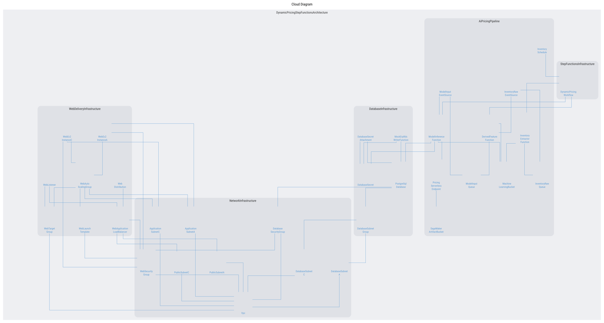
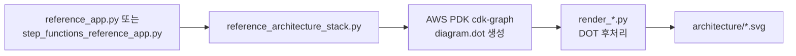

# AWS PDK 인프라 다이어그램

이 폴더는 Python CDK Construct Tree를 AWS PDK `CdkGraphDiagramPlugin`으로 분석해 생성한 Graphviz DOT 및 SVG 인프라 다이어그램을 보관합니다.

## 다이어그램 종류

| 파일 | 용도 |
|---|---|
| `dynamic-pricing-reference.svg` | Step Functions를 추가하기 전의 참조 관계 다이어그램 |
| `dynamic-pricing-with-step-functions.svg` | Step Functions를 처음 포함한 보존용 SVG |
| `dynamic-pricing-step-functions-directed.svg` | 선행 리소스→사용 리소스 방향과 실행 흐름을 표현한 유향 그래프 |
| `dynamic-pricing-step-functions-undirected.svg` | 화살표 없이 연결 관계만 보여 주는 문서용 무향 그래프 |
| 같은 이름의 `.dot` | Graphviz 소스. 선·화살표·배치 후처리 확인용 |

SVG는 확대해도 선명한 기본 결과물입니다. SVG 내부에서 참조하는 AWS Architecture 아이콘은 이 폴더의 서비스별 하위 경로에 함께 저장됩니다.

## 생성 과정

## 시각화 범위

다이어그램은 다음 핵심 런타임 영역을 표시합니다.

- **Network Infrastructure**: VPC, Public/Application/Database Subnet, Security Group
- **Web Delivery Infrastructure**: CloudFront, ALB, Listener, Target Group, Auto Scaling Group, EC2
- **Database Infrastructure**: PostgreSQL RDS, DB Subnet Group, Secrets Manager, Mock ERP Writer Lambda
- **AI Pricing Pipeline**: EventBridge Scheduler, Lambda, SQS, S3, SageMaker Endpoint
- **Step Functions Infrastructure**: 다이나믹 프라이싱 작업 순서를 나타내는 State Machine

IAM Role과 Instance Profile은 권한 설명을 위한 노드이므로 핵심 실행 흐름의 가독성을 위해 필터링합니다. 역할 간 권한 관계를 검토할 때는 배포용 CDK/CloudFormation을 별도로 확인해야 합니다.

## 선과 화살표 해석

- 모든 연결선은 실선이며 직각(`ortho`) 라우팅을 사용합니다.
- 유향 그래프에서는 일반 인프라 의존 관계를 `선행 리소스 → 이를 사용하는 리소스`로 표시합니다.
- 실행·데이터 흐름은 `Scheduler → Step Functions → Lambda`, Lambda → SQS/SageMaker 등의 실제 흐름 방향을 유지합니다.
- 무향 그래프는 화살표를 제거했으므로 “두 리소스가 연결되어 있음”만 의미합니다.

PDK 원본은 의존 관계를 `리소스 → 의존 대상`으로 기록할 수 있습니다. `render_step_functions_diagram.py`가 문서용 유향 그래프에서 이 방향을 해석 가능한 방향으로 정리합니다.

## 아이콘 및 후처리

- PDK가 인식하는 CDK L1 리소스에는 공식 AWS Architecture 아이콘을 사용합니다.
- PDK 0.26.15에서 `AWS::Scheduler::Schedule`의 직접 아이콘 매핑이 없으므로 EventBridge Rule 아이콘을 사용합니다.
- 모든 AWS 아이콘은 최종 SVG에 Base64 데이터로 내장합니다. 따라서 README·GitHub처럼 SVG 내부의 외부 이미지 참조를 차단하는 환경에서도 아이콘이 유지됩니다.
- 선 집중(`concentrate`)을 끄고, 노드보다 연결선을 먼저 렌더링하며, 노드·계층 간 간격을 조정해 교차와 겹침을 줄입니다.

## 주의사항

이 다이어그램은 AWS 계정의 현재 상태를 실시간으로 읽어 생성하는 자료가 아닙니다. IaC Generator export와 시각화 전용 CDK Stack을 바탕으로 만든 참조 모델입니다.

- `reference_architecture_stack.py`의 placeholder 및 명시적 dependency는 다이어그램 관계 복원용입니다.
- 그림 생성 파일을 배포하거나 `cdk deploy`하지 마세요.
- 원본 배포 Stack은 상위 폴더의 `dynamic_pricing_infrastructure_stack_stack.py`입니다.
